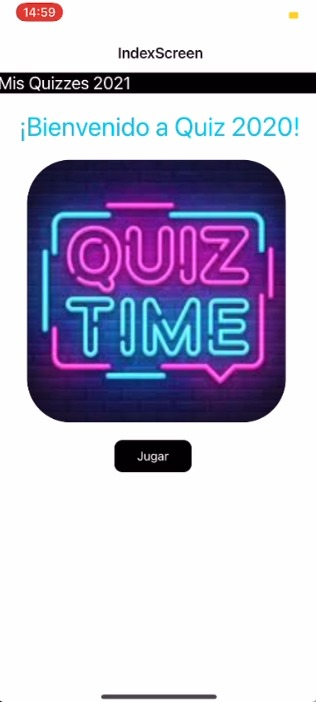
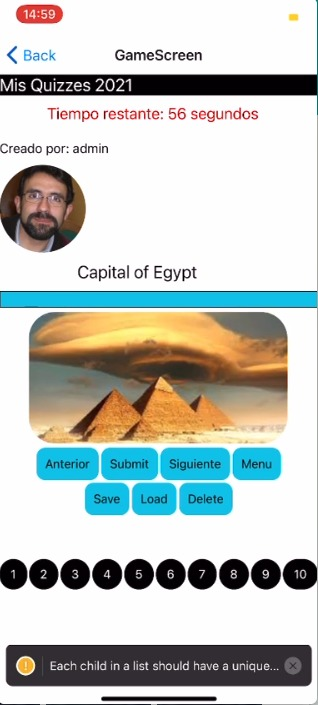
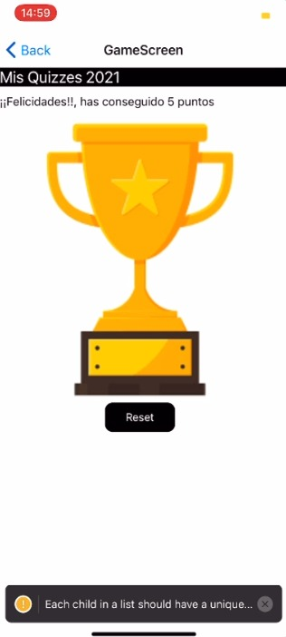
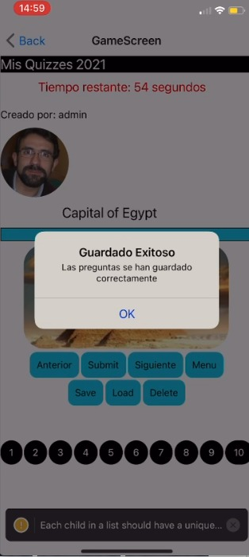

# Quiz_React_Native-Redux
Juego de preguntas para un teléfono móvil creado con React Native y Redux. Se descargan 10 preguntas aleatorias de una servidor y se pueden responder. Además se implementas más funcionalidades como cambiar de pantallas, guardar en el móvil las preguntas, etc.

### Pantalla inicio

### Pantalla preguntas

### Victoria

### Otras funcionalidades

La aplicación tiene otra funcionalidades adicionales como puede verse, por ejemplo un botón **guardar** para almacenar en la memoria del teléfono las preguntas

